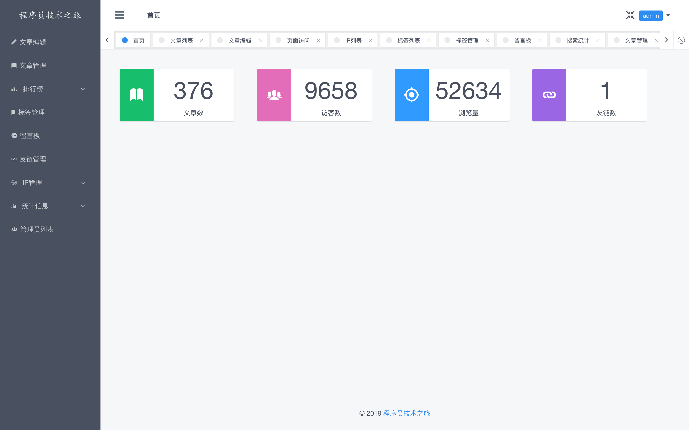
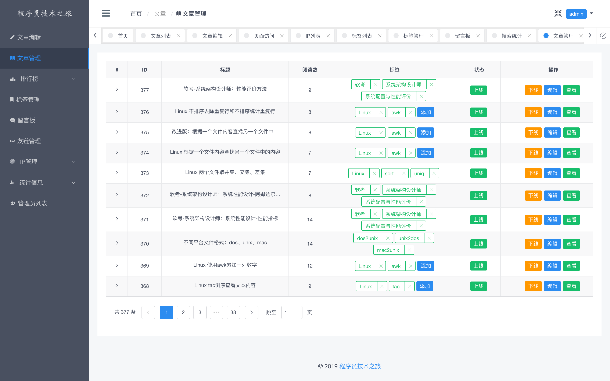
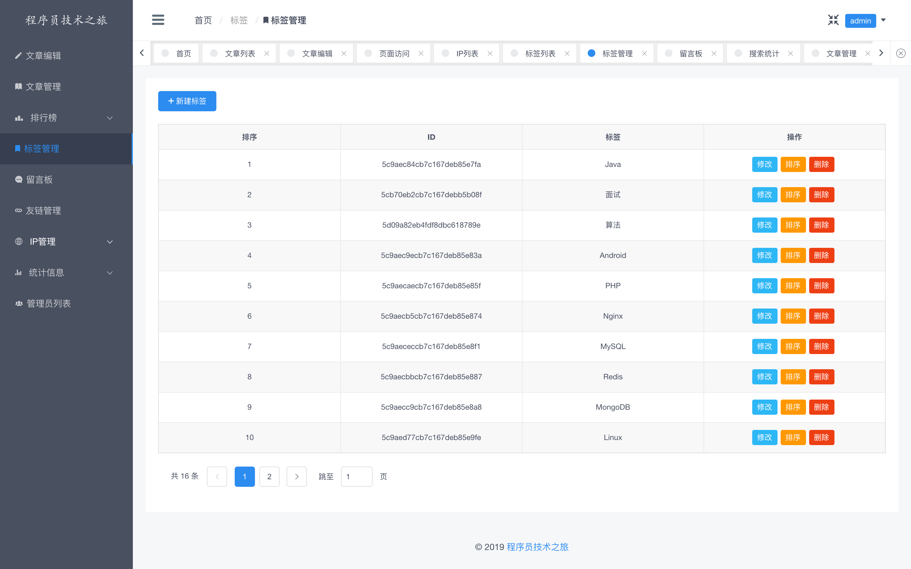
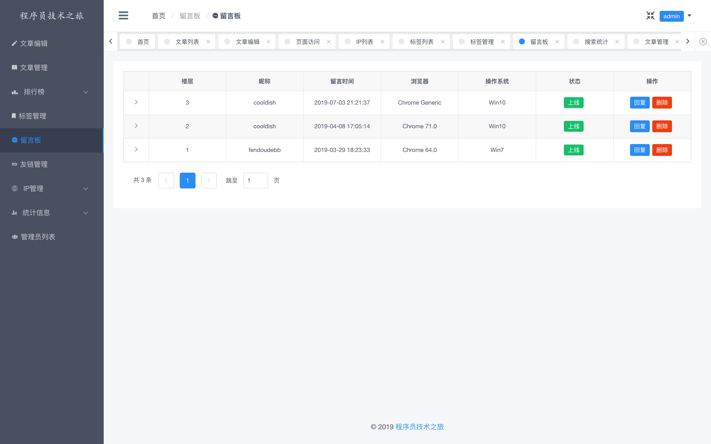
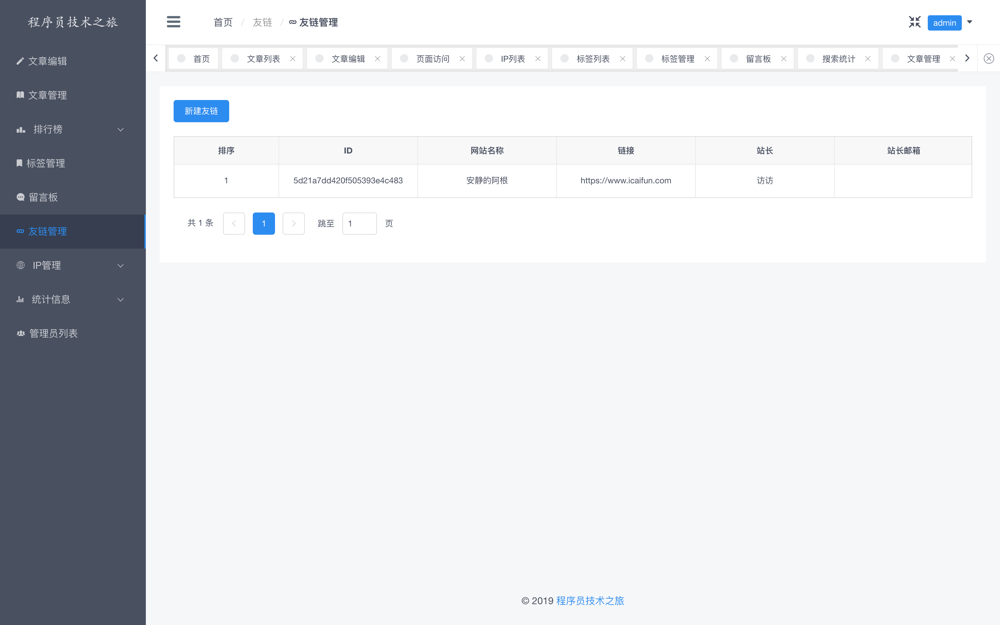
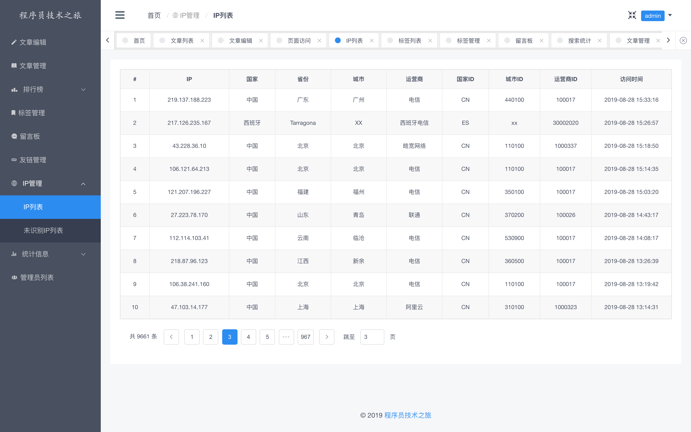
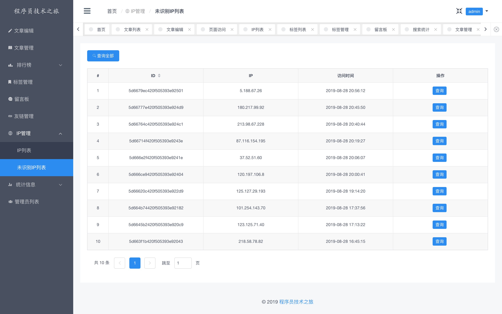
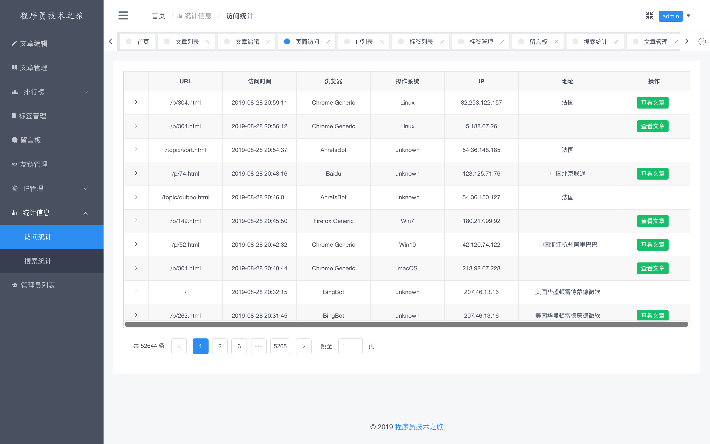
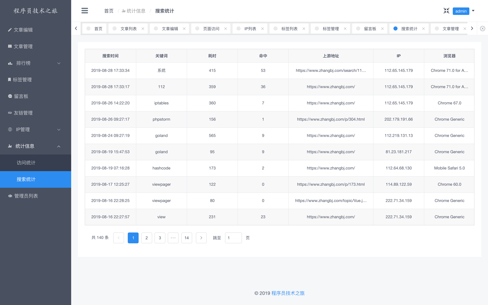

# Blog项目后台管理

## 项目地址
[https://admin.zhangbj.com](https://admin.zhangbj.com)

## 技术栈
- [Vue.js: 构建框架](https://github.com/vuejs/vue)
- [iview: 页面控件](https://github.com/iview/iview)
- [axios: 网络请求框架](https://github.com/axios/axios)
- [mavonEditor: 基于Vue的markdown编辑器](https://github.com/hinesboy/mavonEditor)
- [node: 包管理器](https://github.com/nodejs/node)
- [webpack: 打包工具](https://github.com/webpack/webpack)

## 主要功能
- 文章管理
- 阅读、点赞、评论排行榜
- 标签管理
- 留言板
- 友链管理
- IP列表
- 未识别IP列表
- 访问统计
- 搜索统计

## 页面展示

### 首页

### 文章管理

### 排行榜

### 标签管理

### 留言板

### 友链管理

### IP列表

### 未识别IP

### 访问统计

### 搜索统计

